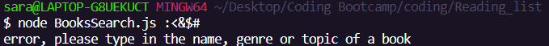

# Reading_list

Hello again, and welcome back to my code. Thank you again for your helpful feedback the first time and for reviewing my refactored code. Most of the information in the readMe has not changed. However, I have included a few new things to assist in the understanding of the app as well as my latest process. Also, there will be a test at the end. Ready? Let's do this!
 
 
 ### How do I use it

You can easily clone this from the repo and test it in your favorite text editor by typing `git clone` and pasting the repo into your terminal.

Once you have the repo cloned type in your terminal `npm install` Once that is installed right click the file `BookSearch.js ` and open it in theterminal then type 
`node BookSearch` and then type in a desired book title, topic or genre.
### Ex:
```
node BookSearch.js Rabbit Care
node BookSearch.js Moby Dick
node BookSearch.js Romantic Slasher 
```
A table will then display five books including the following api informaion

* Title
* Author
* Publisher

After that the user is asked to choose a book from the readling list.

If none of the books tickle their fancy they can press Ctrl C to start over.

If they do find one they just select from the array given to them and then it is saved inside their reading list.

### What if I want to be a troll and break the code?
 Glad you asked! I created a new function called containsSpecialCharacters which includes an array of characters such as 
 "{[%$#" that might accidentally get typed by the user or their mischevious cat sitting on the keyboard. If any of the characters inside the list were to be entered a helpful error message like the one featured in the image below will pop up. 
 

This message will also appear if nothing is typed. I did not include numbers because when I ran the app and searched with numbers many books came up and I did not want to make my search requirements too strict right now. 

### Running the tests
My tests are passing Wooohooo! I realized that my original attempt was geared more toward React components and I did not need to make so many separate files.

### To run the tests go to the terminal and type 
`npm test`


### Who is this app for?

This app was created for the busy coder who loves to read. Now they can simply search for a book within the comfort of their own terminal. 

### What was my process for doing the things I did THIS TIME AROUND?
  Coding can be like building a house of cards sometimes, one wrong step and it can feel like it's all falling apart. I decided that regardless of the outcome I would code without fear and not let the idea of failure paralyze me from move beyond an MVP.
 I set my focus first on refactoring what was asked of me and then trying to go beyond that and see what happened. I tried a few things like extracting the functions and putting them inside their own files in the src but I had trouble figuring out how to rewrite my tests and wanted to include passing tests in this sprint. Also, my first attempt at creating a special character parameters failed and currently as I write this I am still trying to get it to work without typing a double error message. On the plus side, some of the things I tried DID WORK which is great


* I chose javascript becasue it is the language I feel most comfortble in right now. 

* I decided to create a table for the data to be displayed on to give the user a better UI experience.

* The reading list is displayed not just inside the terminal but in a seperate json folder as an added precaution.

* I orignally adding a .env file, only to realize after looking again at the documentation and the instructions of the code challenge that it would be okay to use the public api and not need to hide a key. 

* I added inquirer as a way to add to the UX as it just seems nicer to be kindly prompted within the app as appose to go to the readme file to figure out how to do everything


### What is next

*If I didnt get time to do it, breaking up the various functionality and seperating them into different js files that would live inside the SRC file and export them into the BookSearch file to make the code cleaner and easier to make changes to.

### Nice to haves

* An ability to choose none of the books from the given list or to exit out without typing ctrl C

* To toggle within the book list and make a selection within the table instead of in a seperate array

* Relying on less dependencies in the future.


### A big thank you to the following dependencies:

* [npm console.table](https://www.npmjs.com/package/console.table).For making the data displayed easy to read. 

* [inquirer](https://www.npmjs.com/package/inquirer). For making the UX better by creating prompts to help the user work the app.

* [fs](https://www.npmjs.com/package/file-system). Thanks for keeping track of my files and making it easier to link things.

* [axios](https://www.npmjs.com/package/axios). Thank you so much for transforming my book requests and responses into data , you're the backbone of this app my friend!

* [Jest](https://jestjs.io/). At first I was like "what is the deal with this clown?" {dad joke intended} that being said, I can truly apprechate all that you do for code, and I hope we can keep working together.


### Honorable mentions

* .env - Everyone knows you are important when an API key need to be kept secret, sorry you got cut from the code good buddy.

* hot yoga - namaste sane thanks to you

* all the documentation

* npm packages

* Github

* My human and non human support system.

### Thank you to whomever is reading this ReadMe file. I figured I would try and add a bit of fun as you probably have to read a lot of these over the next few weeks. 
### Looking forward to your feedback

### -Sara :)

### Here is the test btw. I hope you were paying attention.

 Which undersea animal can deliver a punch that is equivalent to a 22 caliber bullet? 
 
 * Mermaid Mike Tyson

 * Mantis Shrimp

 * Punchy, the only whale with arms.


